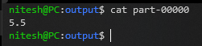

# Hadoop

`Nitesh Srivats`

`1BM17CS037`

Lab Date: `03/11/2020`

Completed: `08/12/2020`

### Steps:
- Compile java file using `javac WordCountDriver.java -cp $(/usr/local/hadoop/bin/hadoop classpath)`
- Move all class files into a folder `build`
- Create a Manifest file `manifest.mf`
- Create a jar file `jar cvmf0 manifest.mf WordCount.jar build/`
- You can execute the jar with `java -jar WordCount.jar`
- You can extract the jar with `java xf WordCount.jar`
- Create input file
- Execute program in hadoop with `hadoop jar WordCount.jar data.txt output`

#### Not Necessary for WSL
- View hadoop file system `hadoop fs -ls`
- Create directory `hadoop fs -mkdir /temp`
- Move files in haddop `hadoop fs -copyFromLocal /path/to/input/file /path/in/hadoop/fs`
Create a new directory (if needed) hadoop fs -mkdir /lab

### Execution

